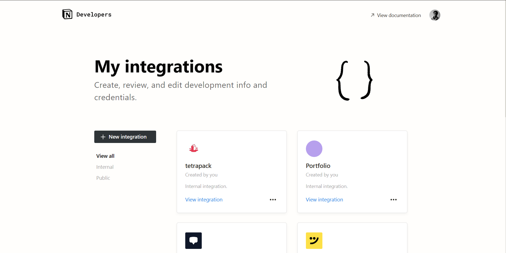
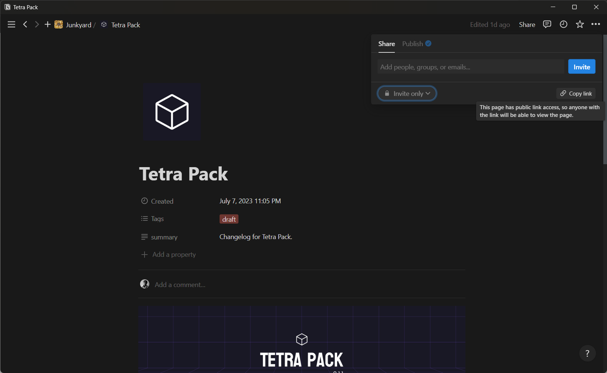

## Starter template for Tetra Pack

The template is made upon [Nextjs](https://nextjs.org/) and [Tailwind typography](https://tailwindcss.com/docs/typography-plugin)

## Usage

-   Step 1

    1.  Get your integration token from [notion developers](https://www.notion.so/my-integrations) dashboard.
        
    2.  Copy the Page ID of the notion page you want to render, from the share option at the top right corner.
        PAGE ID = https://www.notion.so/Tetra-Pack-401aa30875db4f97b2d4e698b328ad45?pvs=4
        This is your id                            |-------------------------------|

     3. Now create a .env file at the root level, having all details.

    ```
    NOTION_TOKEN = <NOTION INTEGRATION TOKEN>
    NOTION_PAGE_ID = <NOTION_PAGE_ID>
    ```

    4.  Start the development server

    ```bash
    npm run dev
    ```
