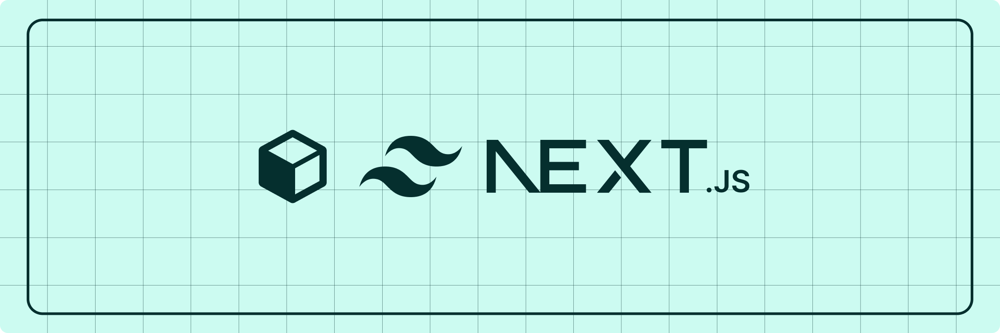

<br><br>
## Starter template for Tetra Pack

The template is made upon [Nextjs](https://nextjs.org/) and [Tailwind typography](https://tailwindcss.com/docs/typography-plugin)

## Usage

1.  Clone the repository
    ```bash
    git clone https://github.com/ashishk1331/tetra-example.git
    ```
    <br>
1.  Initialize all packages
    ```bash
    npm install
    ```
    <br>
1.  Get your integration token from [notion developers](https://www.notion.so/my-integrations) dashboard.
    <br>
1.  Copy the Page ID of the notion page you want to render, from the share option at the top right corner.
    PAGE ID = https://www.notion.so/Tetra-Pack-401aa30875db4f97b2d4e698b328ad45?pvs=4
    <br>
    This is your id = 401aa30875db4f97b2d4e698b328ad45
    <br>
1.  Now create a .env file at the root level, having all details.
    ```
    NOTION_TOKEN = <NOTION_INTEGRATION_TOKEN>
    NOTION_PAGE_ID = <NOTION_PAGE_ID>
    ```
    <br>
1.  Start the development server

    ```bash
    npm run dev
    ```
    <br>